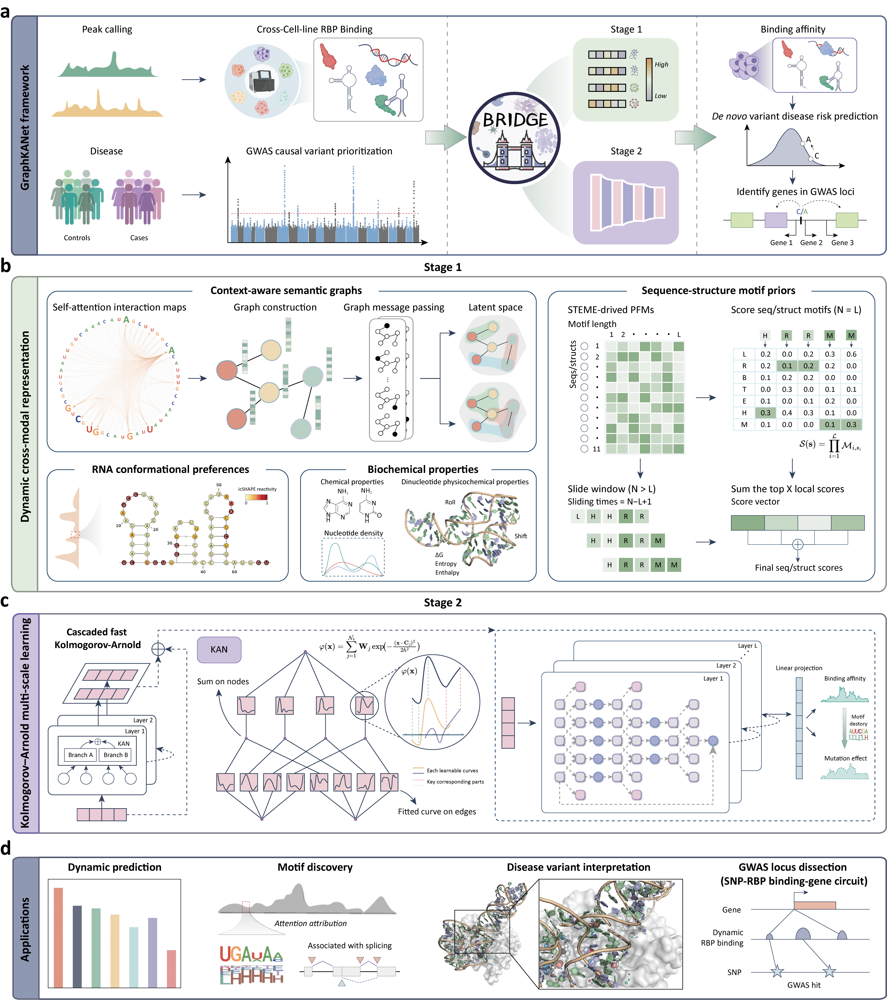

# BRIDGE: Multimodal RBP Binding Prediction

## Overview


BRIDGE is an advanced multimodal deep learning framework designed to predict RNA–protein binding landscapes with high accuracy and robust cross-cell-type generalization. It leverages a unified architecture that integrates:

- **Sequence embeddings** from pretrained Transformer models to capture rich contextual nucleotide representations.
- **RNA secondary structure features** to model the spatial and thermodynamic constraints on RBP binding.
- **Motif priors** derived from experimentally validated or attention-guided motif discovery to incorporate known binding patterns
- **Biochemical profiles** capturing experimental signals such as reactivity, accessibility, and conservation.
- **Graph-based attention modeling** to represent long-range dependencies between nucleotides via token-wise relational graphs.

By fusing these complementary modalities, BRIDGE can accurately characterize both conserved and dynamic binding preferences, enabling:

- **End-to-end model training and evaluation** on large-scale eCLIP/HITS-CLIP datasets.
- **Dynamic cross-cell-type transfer prediction**, where the model generalizes to unseen cellular contexts without fine-tuning.
- **Variant-aware inference**, assessing the functional impact of genetic variants (e.g., SNVs, indels) on RBP binding to facilitate disease and trait association studies.
- **Explicit motif extraction** highlighting dynamic sequence–structure patterns learned from the fused modalities.

This multimodal and interpretable design positions BRIDGE as a powerful tool for dissecting post-transcriptional regulation, guiding functional genomics studies, and prioritizing disease-associated variants with potential regulatory impact.

## Environment Setup

### 1) Prerequisites

- Python = 3.10.10
- CUDA-enabled GPU recommended (24 GB VRAM for typical batch sizes)
- PyTorch (matching your CUDA version)
- Hugging Face Transformers (for the tokenizer/model loader)
- Optional: PyTorch Geometric (GCNConv), TensorBoard/PyCrayon for logging

### 2) Recommended installation (Conda)

```bash
# Create and activate an environment
conda create -n BRIDGE python=3.10.10
conda activate BRIDGE
pip install -r reqs.txt
```

## Usage

Below are the exact commands you provided, with annotations for each flag so the README doubles as a quick reference.

### 1) Train

```bash
python main.py \
    --train \
    --data_path ./dataset \
    --data_file LIN28B_HEK293 \
    --device_num 0 \
    --early_stopping 20 \
    --Transformer_path ./RBPformer \
    --model_save_path ./results/model \
    --lr 0.001
```

**Flags explained**

- `--train`
   Run end-to-end training (with internal train/validation split if implemented in your code).
- `--data_path ./dataset`
   Folder containing `<DATA_FILE>_pos.fa` and `<DATA_FILE>_neg.fa`.
- `--data_file LIN28B_HEK293`
   Dataset stem. Loader looks for `LIN28B_HEK293_pos.fa` and `LIN28B_HEK293_neg.fa` in `--data_path`.
- `--device_num 0`
   Index of the CUDA device (equivalent to `torch.cuda.set_device(0)`).
- `--early_stopping 20`
   Patience for early stopping (stop if validation metric does not improve for 20 epochs).
- `--Transformer_path ./RBPformer`
   Local directory of the pretrained Transformer/“RBPformer” checkpoint (tokenizer + model).
- `--model_save_path ./results/model`
   Directory to save checkpoints (best/last), logs, etc.
- `--lr 0.001`
   Initial learning rate.

**Outputs (typical)**

- Model checkpoints saved under `--model_save_path` (exact filenames depend on your code).
- Training logs/metrics (e.g., via stdout or logging utilities if enabled).

### 2) Validate (Evaluate a saved model)

```bash
python main.py \
    --validate \
    --data_path ./dataset \
    --data_file LIN28B_HEK293 \
    --device_num 0 \
    --Transformer_path ./RBPformer \
    --model_save_path ./results/model
```

**Flags explained**

- `--validate`
   Run validation/evaluation only. The code will load the model from `--model_save_path` (ensure a trained checkpoint exists).
- Other flags are identical in meaning to the Train section.

**Notes**

- Make sure the checkpoint you want to evaluate is present in `--model_save_path`.
- If multiple checkpoints exist, your code should define which to load (best/last).

### 3) Dynamic Transfer Prediction (Cross–cell-type)

```bash
python main.py \
    --dynamic_predict \
    --data_path ./dataset \
    --data_file AGGF1_K562 \
    --device_num 0 \
    --Transformer_path ./RBPformer \
    --model_save_path ./results/model
```

**Flags explained**

- `--dynamic_predict`
   Perform zero-shot / cross–cell-type inference (train on source, test on target), depending on how your code wires it.
- `--data_file AGGF1_K562`
   Target dataset stem for dynamic prediction.
- Remaining flags carry the same meaning as above.

**Notes**

- Ensure the correct source-trained model is available under `--model_save_path`, or that your script internally handles the required training → transfer pipeline.

### 4) Variant-Aware GWAS Scoring

```bash
python variant_aware_GWAS.py \
    --gwas_after_variation \
    --fasta_sequence_path ./dataset_variant/AGGF1_K562.fa \
    --Transformer_path ./RBPformer \
    --model_save_path ./results/model \
    --variant_out_file ./results/variants/AGGF1_K562_after_mut.txt \
    --device cuda:3
```

**Flags explained**

- `--gwas_after_variation`
   Use the post-mutation sequences to compute variant-aware scores.
- `--fasta_sequence_path`
   Path to the FASTA-like file to score (3-line records).
- `--Transformer_path` / `--model_save_path`
   Same as above; specify the Transformer directory and the trained BRIDGE model location.
- `--variant_out_file`
   Output path for scored variants. (Your script defines the exact columns—typically it includes IDs/coordinates and scores.)
- `--device cuda:3`
   Explicit device string when using multiple GPUs (here GPU index 3). You can also use `cuda:0`, `cpu`, etc.

**Notes**

- Ensure that the variant FASTA input uses the same tokenization assumptions (A/C/G/T or A/C/G/U) and the structure/score line matches the sequence length.

### 5) Motif construction


#### Step 1: Generate attention maps for motif visualization

```bash
export KMER=1
export MODEL_PATH=../RBPformer
export DATA_PATH=examples/AARS_K562
export PREDICTION_PATH=examples/AARS_K562

python run_finetune.py \
    --model_type dna \
    --tokenizer_name $MODEL_PATH \
    --model_name_or_path $MODEL_PATH \
    --task_name dnaprom \
    --do_visualize \
    --visualize_data_dir $DATA_PATH \
    --visualize_models $KMER \
    --data_dir $DATA_PATH \
    --max_seq_length 101 \
    --per_gpu_pred_batch_size=4 \
    --output_dir $MODEL_PATH \
    --predict_dir $PREDICTION_PATH \
    --n_process 96
```

**Flags explained**

- `--model_type dna`
   Sets the model type for processing DNA/RNA sequences.
- `--tokenizer_name` / `--model_name_or_path`
   Paths to the pretrained RBPformer tokenizer and model.
- `--task_name dnaprom`
   Task identifier (inherited from training scripts; here for promoter-like sequence processing).
- `--do_visualize`
   Enables generation of attention maps for visualization.
- `--visualize_data_dir`
   Input data folder containing sequences.
- `--visualize_models`
   K-mer length (here set via `$KMER`).
- `--data_dir`
   Same as input data path.
- `--max_seq_length`
   Maximum sequence length (should match training config).
- `--per_gpu_pred_batch_size`
   Prediction batch size per GPU.
- `--output_dir`
   Directory for saving outputs.
- `--predict_dir`
   Directory for prediction results.
- `--n_process`
   Number of parallel processes for data handling.

#### Step 2: Discover motifs from attention maps

```bash
export KMER=1
echo $(pwd)
export DATA_PATH=examples/AARS_K562
export ATTENTION_PATH=examples/AARS_K562
export OUTPUT_PATH=examples/AARS_K562/result

python motif/Discovery_motifs.py \  
    --input_rna_dir $DATA_PATH \
    --attention_dir $ATTENTION_PATH \
    --motif_length 6 \
    --min_region_len 6 \
    --fdr_cutoff 0.01 \
    --min_motif_count 3 \
    --align_all_ties \
    --output_motif_dir $OUTPUT_PATH \
    --verbose
```

**Flags explained**

- `--input_rna_dir`
   Directory containing RNA sequences used for motif extraction.
- `--attention_dir`
   Directory with saved attention scores from Step 1.
- `--motif_length`
   Target motif length.
- `--min_region_len`
   Minimum contiguous region length for candidate motifs.
- `--fdr_cutoff`
   False discovery rate threshold for motif selection.
- `--min_motif_count`
   Minimum number of motif occurrences to be considered significant.
- `--align_all_ties`
   Align motifs even if multiple sequences have identical scores.
- `--output_motif_dir`
   Output folder for discovered motifs.
- `--verbose`
   Enables detailed logging.

## License

This project is licensed under the MIT License.
See the LICENSE file for details.

## Citation

If you use BRIDGE in your research, please cite this repository and the accompanying manuscript (add the BibTeX entry here once available).

```
Unpublished yet
```

## Acknowledgements

- Hugging Face Transformers for tokenizer/model loading.
- PyTorch & PyTorch Geometric for deep learning and GNN components.

**Email**: yubo23@mails.jlu.edu.cn